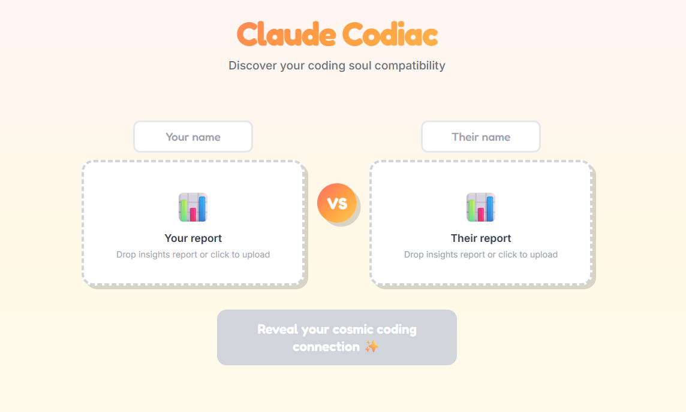

# Claude Codiac



A fun, social web app that compares two Claude Code `/insights` reports and generates zodiac-style personality comparisons. Discover your coding soul compatibility!

**Live at: [codiac.amditis.tech](https://codiac.amditis.tech)**

## Features

- Upload two Claude Code insights reports (drag & drop or click)
- Get assigned an animal mascot based on your coding patterns
- See your compatibility score with fun personality analysis
- Every comparison gets a unique shareable URL
- Download a shareable screenshot image
- Tracks total "coding souls" analyzed

## Getting your insights report

In Claude Code, run:
```
/insights
```

This generates an HTML report. Save it and upload it to Claude Codiac.

## Animal mascots

Based on usage patterns, users are classified as:

| Mascot | Title | Pattern |
|--------|-------|---------|
| 🦫 Beaver | The Builder | High Edit/Write ratio (>35% of tools) |
| 🦅 Hawk | The Commander | Bash >50% of tool calls |
| 🦉 Owl | The Architect | High Read ratio + night activity |
| 🐆 Cheetah | The Sprinter | Median response time <30s |
| 🐙 Octopus | The Multi-tasker | Multi-clauding >10% |
| 🦜 Parrot | The Polyglot | 4+ languages with significant usage |
| 🦊 Fox | The Debugger | High error rate (>10%) |
| 🐻 Bear | The Marathoner | >500 msgs/day |

## Compatibility score

The compatibility percentage is calculated from:
- Tool usage distribution: 30%
- Language overlap: 25%
- Response time similarity: 15%
- Activity time overlap: 15%
- Multi-clauding behavior: 15%

## Architecture

```
┌─────────────────────────────────────────────────────────┐
│  Frontend (Cloudflare Pages)                            │
│  codiac.amditis.tech                                    │
│  - Single HTML file with embedded CSS/JS                │
│  - Parses insights reports client-side                  │
│  - Canvas-based screenshot generation                   │
└─────────────────────────────────────────────────────────┘
                           │
                           ▼
┌─────────────────────────────────────────────────────────┐
│  API Worker (Cloudflare Workers)                        │
│  codiac-share.jamditis.workers.dev                      │
│  - POST /api/share - Save comparison, return unique ID  │
│  - GET /api/share/:id - Retrieve saved comparison       │
│  - GET /api/stats - Get total comparison count          │
└─────────────────────────────────────────────────────────┘
                           │
                           ▼
┌─────────────────────────────────────────────────────────┐
│  Storage (Cloudflare R2)                                │
│  - codiac/shares/{id}.json - Saved comparisons          │
│  - codiac/stats/counter.json - Global counter           │
└─────────────────────────────────────────────────────────┘
```

## Local development

The frontend is a single HTML file that works standalone:

```bash
# Just open in browser
open index.html

# Or serve locally
python -m http.server 8765
```

For the worker:

```bash
cd worker
npm install
wrangler dev
```

## Deployment

Frontend:
```bash
wrangler pages deploy . --project-name codiac
```

Worker:
```bash
cd worker
wrangler deploy
```

## Credits

Made with ✨ by [Claude](https://claude.ai) & [Joe Amditis](https://github.com/jamditis)
